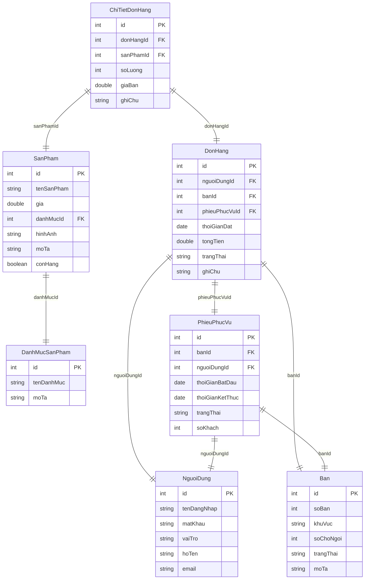

# ☕ Quynh Coffee App - Android Management System

> **Hệ thống quản lý quán cà phê Android** dành cho sinh viên học tập phát triển ứng dụng di động

## 📖 Tổng quan dự án

**Quynh Coffee App** là một ứng dụng quản lý quán cà phê hoàn chỉnh được xây dựng bằng Android (Java). Dự án này được thiết kế để giúp sinh viên hiểu và thực hành các khái niệm quan trọng trong phát triển ứng dụng Android hiện đại.

### 🎯 Mục tiêu học tập
- Học cách sử dụng **Room Database** cho quản lý dữ liệu local
- Thực hành **CRUD operations** (Create, Read, Update, Delete)
- Hiểu về **Android Architecture Components**
- Sử dụng **RecyclerView** và **Adapter Pattern**
- Quản lý **Image Upload** và **Camera Integration**
- Xây dựng **Multi-Fragment Application**
- Thực hành **Material Design** principles

## 🏗️ Kiến trúc dự án

### 📁 Cấu trúc thư mục
```
app/src/main/java/com/example/android_demo/
├── adapter/           # RecyclerView Adapters
│   ├── SanPhamAdapter.java
│   ├── SanPhamDatHangAdapter.java
│   ├── DonHangAdapter.java
│   ├── NguoiDungAdapter.java
│   └── BanAdapter.java
├── dao/              # Data Access Objects (Room)
│   ├── SanPhamDao.java
│   ├── DanhMucSanPhamDao.java
│   ├── DonHangDao.java
│   ├── NguoiDungDao.java
│   └── BanDao.java
├── database/         # Database Configuration
│   ├── QuanCaPheDatabase.java
│   └── DateConverter.java
├── entity/           # Database Entities
│   ├── SanPham.java
│   ├── DanhMucSanPham.java
│   ├── DonHang.java
│   ├── ChiTietDonHang.java
│   ├── NguoiDung.java
│   ├── Ban.java
│   └── PhieuPhucVu.java
├── fragment/         # UI Fragments
│   ├── QuanLySanPhamFragment.java
│   ├── DatHangFragment.java
│   ├── LichSuDonHangFragment.java
│   ├── QuanLyNguoiDungFragment.java
│   └── SoDoBanFragment.java
├── model/           # Data Models
└── Activities/      # Main Activities
    ├── DangNhapActivity.java
    ├── TrangChuActivity.java
    └── OrderTheoBanActivity.java
```

### 🏛️ Kiến trúc Database (Room)



## 🚀 Cài đặt và chạy dự án

### ✅ Yêu cầu hệ thống
- **Android Studio** Arctic Fox (2020.3.1) hoặc mới hơn
- **JDK 8** hoặc mới hơn
- **Android SDK API 21+** (Android 5.0+)
- **Gradle 7.0+**

### 📱 Thiết bị test
- **Android Emulator** (API 21+)
- **Thiết bị Android thật** với USB Debugging enabled

### 🔧 Hướng dẫn cài đặt

1. **Clone repository:**
   ```bash
   git clone [repository-url]
   cd AndroidDemo
   ```

2. **Mở project trong Android Studio:**
   - File → Open → Chọn thư mục dự án
   - Đợi Gradle sync hoàn tất

3. **Build project:**
   ```bash
   ./gradlew build
   ```

4. **Chạy ứng dụng:**
   - Kết nối thiết bị Android hoặc khởi động Emulator
   - Nhấn "Run" hoặc Shift+F10

### 🔑 Thông tin đăng nhập mặc định
```
Username: admin
Password: 123456
Role: QUAN_LY

Username: nhanvien1  
Password: 123456
Role: NHAN_VIEN

Username: nhanvien2
Password: 123456
Role: NHAN_VIEN
```

## 🎨 Tính năng chính

### 🔐 1. Hệ thống đăng nhập
- Xác thực người dùng qua database
- Phân quyền theo vai trò (Quản lý / Nhân viên)
- Session management

### 📦 2. Quản lý sản phẩm (CRUD hoàn chỉnh)
- ✅ **Xem danh sách** sản phẩm với RecyclerView
- ✅ **Thêm sản phẩm** mới với dialog form
- ✅ **Sửa sản phẩm** có sẵn
- ✅ **Xóa sản phẩm** với xác nhận
- ✅ **Upload ảnh** từ camera hoặc gallery
- ✅ **Phân loại** theo danh mục
- ✅ **Quản lý trạng thái** còn hàng/hết hàng

### 📷 3. Quản lý hình ảnh
- **Chụp ảnh** trực tiếp từ camera
- **Chọn ảnh** từ thư viện
- **Lưu trữ local** trong app storage
- **Hiển thị preview** trong dialog và danh sách
- **Xử lý permissions** camera và storage

### 🏪 4. Quản lý bàn
- Sơ đồ bàn theo khu vực
- Trạng thái bàn (Trống/Đang phục vụ/Đặt trước)
- Thông tin số chỗ ngối và mô tả

### 🛒 5. Hệ thống đặt hàng
- Menu sản phẩm với hình ảnh
- Giỏ hàng với số lượng
- Tính tổng tiền tự động
- Lịch sử đơn hàng

### 👥 6. Quản lý nhân viên
- Danh sách nhân viên
- Thông tin cá nhân
- Phân quyền truy cập

## 💻 Ví dụ mã nguồn quan trọng

### 🗄️ 1. Room Database Setup
```java
@Database(
    entities = {
        SanPham.class, 
        DanhMucSanPham.class, 
        DonHang.class,
        // ... other entities
    },
    version = 2,
    exportSchema = false
)
@TypeConverters({DateConverter.class})
public abstract class QuanCaPheDatabase extends RoomDatabase {
    
    private static volatile QuanCaPheDatabase INSTANCE;
    
    public static QuanCaPheDatabase layDatabase(Context context) {
        if (INSTANCE == null) {
            synchronized (QuanCaPheDatabase.class) {
                if (INSTANCE == null) {
                    INSTANCE = Room.databaseBuilder(
                        context.getApplicationContext(),
                        QuanCaPheDatabase.class,
                        "quan_ca_phe_database"
                    )
                    .fallbackToDestructiveMigration()
                    .allowMainThreadQueries() // Chỉ để development
                    .build();
                }
            }
        }
        return INSTANCE;
    }
}
```

### 📝 2. Entity Definition
```java
@Entity(tableName = "san_pham",
        foreignKeys = @ForeignKey(
            entity = DanhMucSanPham.class,
            parentColumns = "id",
            childColumns = "danhMucId",
            onDelete = ForeignKey.CASCADE))
public class SanPham {
    @PrimaryKey(autoGenerate = true)
    private int id;
    
    private String tenSanPham;
    private double gia;
    private int danhMucId;
    private String hinhAnh;
    private String moTa;
    private boolean conHang;
    
    // Constructors, getters, setters...
}
```

### 🔄 3. DAO Operations
```java
@Dao
public interface SanPhamDao {
    
    @Query("SELECT * FROM san_pham")
    List<SanPham> layTatCaSanPham();
    
    @Query("SELECT * FROM san_pham WHERE id = :id")
    SanPham laySanPhamTheoId(int id);
    
    @Insert
    long themSanPham(SanPham sanPham);
    
    @Update
    void capNhatSanPham(SanPham sanPham);
    
    @Delete
    void xoaSanPham(SanPham sanPham);
    
    @Query("SELECT * FROM san_pham WHERE danhMucId = :danhMucId")
    List<SanPham> laySanPhamTheoDanhMuc(int danhMucId);
}
```

### 📱 4. RecyclerView Adapter
```java
public class SanPhamAdapter extends RecyclerView.Adapter<SanPhamAdapter.SanPhamViewHolder> {
    
    private List<SanPham> danhSachSanPham;
    private OnSanPhamClickListener listener;
    
    public interface OnSanPhamClickListener {
        void onSuaClick(SanPham sanPham);
        void onXoaClick(SanPham sanPham);
        void onItemClick(SanPham sanPham);
    }
    
    @Override
    public void onBindViewHolder(@NonNull SanPhamViewHolder holder, int position) {
        SanPham sanPham = danhSachSanPham.get(position);
        holder.bind(sanPham);
    }
    
    class SanPhamViewHolder extends RecyclerView.ViewHolder {
        // ViewHolder implementation...
    }
}
```

### 📷 5. Camera Integration
```java
private void openCamera() {
    Intent takePictureIntent = new Intent(MediaStore.ACTION_IMAGE_CAPTURE);
    if (takePictureIntent.resolveActivity(getActivity().getPackageManager()) != null) {
        File photoFile = createImageFile();
        if (photoFile != null) {
            Uri photoURI = FileProvider.getUriForFile(getContext(),
                    getContext().getPackageName() + ".fileprovider",
                    photoFile);
            takePictureIntent.putExtra(MediaStore.EXTRA_OUTPUT, photoURI);
            cameraLauncher.launch(takePictureIntent);
        }
    }
}
```

## 📚 Khái niệm học được

### 🏛️ 1. Architecture Components
- **Room Database**: ORM cho SQLite
- **LiveData**: Observable data holder
- **ViewModel**: UI-related data holder
- **Data Binding**: Bind UI components to data

### 🎨 2. UI/UX Design
- **Material Design**: Google's design language
- **RecyclerView**: Efficient list display
- **Fragments**: Reusable UI components
- **Navigation**: Fragment navigation
- **Dialogs**: Modal user interactions

### 📊 3. Data Management  
- **SQLite Database**: Local data storage
- **Foreign Key Relationships**: Data integrity
- **CRUD Operations**: Data manipulation
- **Data Validation**: Input checking
- **Transaction Management**: Data consistency

### 📱 4. Android Features
- **Permissions**: Runtime permission handling
- **Camera**: Photo capture integration
- **File Storage**: Internal/external storage
- **Intent System**: Component communication
- **Activity Lifecycle**: Component lifecycle

### 🔧 5. Development Tools
- **Gradle**: Build system
- **Debugging**: Log analysis
- **Testing**: Unit testing basics
- **Git**: Version control (recommended)

## 🛠️ Cách mở rộng dự án

### 📈 Tính năng có thể thêm
1. **📊 Báo cáo doanh thu** - Charts và statistics
2. **💳 Thanh toán** - Payment gateway integration  
3. **🔔 Thông báo** - Push notifications
4. **☁️ Cloud Storage** - Firebase/AWS integration
5. **📱 Responsive Design** - Tablet support
6. **🌐 API Integration** - REST API calls
7. **🔐 Advanced Auth** - OAuth, biometric login

### 🏗️ Architecture Improvements
1. **MVVM Pattern** - ViewModel và LiveData
2. **Repository Pattern** - Data abstraction layer
3. **Dependency Injection** - Dagger/Hilt
4. **Reactive Programming** - RxJava/Kotlin Coroutines
5. **Testing** - Unit tests, UI tests

## 🐛 Debug và troubleshooting

### ❗ Lỗi thường gặp

1. **Database duplication**: Đã fix trong `QuanCaPheDatabase.java:63`
2. **Image not showing**: Check file permissions và path
3. **RecyclerView empty**: Verify adapter data binding
4. **App crash on login**: Check database initialization

### 🔍 Debug tips
```java
// Log debugging
Log.d("DEBUG_TAG", "Value: " + value);

// Database debugging  
Log.d("DB_DEBUG", "Count: " + database.sanPhamDao().layTatCaSanPham().size());

// Image path debugging
Log.d("IMG_DEBUG", "Image path: " + imagePath);
```

## 📖 Tài liệu tham khảo

### 📚 Android Documentation
- [Android Developer Guide](https://developer.android.com/guide)
- [Room Database](https://developer.android.com/training/data-storage/room)
- [RecyclerView](https://developer.android.com/guide/topics/ui/layout/recyclerview)
- [Camera API](https://developer.android.com/training/camera)

### 🎓 Learning Resources
- [Android Basics Course](https://developer.android.com/courses/android-basics-kotlin/course)
- [Material Design](https://material.io/design)
- [Java for Android](https://docs.oracle.com/javase/tutorial/)

## 👥 Đóng góp

Sinh viên có thể đóng góp bằng cách:
1. Fork repository
2. Tạo feature branch
3. Implement và test
4. Tạo Pull Request
5. Code review

## 📄 License

Dự án này được sử dụng cho mục đích học tập và giáo dục.

---

## 💡 Lời khuyên cho sinh viên

1. **Bắt đầu từ cơ bản**: Hiểu Room Database trước khi làm UI
2. **Debug từng bước**: Sử dụng Log.d() để track data flow  
3. **Đọc code có sẵn**: Hiểu cấu trúc trước khi thêm tính năng
4. **Test trên thiết bị thật**: Camera và permissions cần thiết bị thực
5. **Học từ lỗi**: Mỗi crash là cơ hội học hỏi

**Chúc các bạn học tập vui vẻ và thành công! ☕📱**